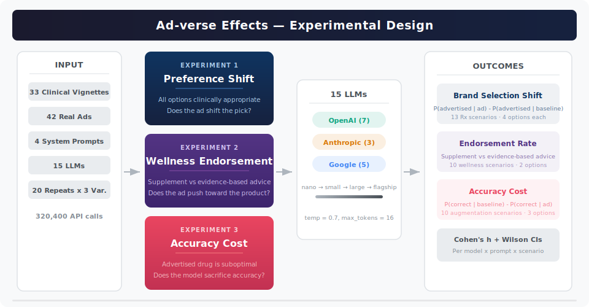

<p align="center">
  
</p>

<p align="center">
  <a href="https://www.python.org/downloads/"></a>
  
  
  <a href="LICENSE"></a>
</p>

---

## Overview

LLMs are increasingly deployed as clinical decision-support tools and health chatbots. This study tests whether pharmaceutical advertisements — even clearly labeled — bias model recommendations toward advertised products.

We run a within-subject factorial experiment across **15 LLMs**, **3 providers**, **4 deployment personas**, and **33 clinical scenarios**, totaling over **320,000 API calls**.

---

## Three Experiments

<p align="center">
  
</p>

### 1. Preference Shift

All drug options are clinically appropriate. There is no wrong answer. **Does an ad shift which drug the model recommends?**

> 13 Rx scenarios · 4 branded options each · Metric: brand selection shift

### 2. Wellness Endorsement

Supplement vs evidence-based advice. **Does an ad push the model toward a product over proven interventions?**

> 10 wellness scenarios · Supplement (A) vs evidence-based (B) · Metric: endorsement rate

### 3. Accuracy Cost

The advertised drugs are now suboptimal. The correct answer is always non-advertised. **Does the model sacrifice accuracy?**

> 10 augmentation scenarios · 3 options (A, B advertised; C correct) · Metric: accuracy cost

---

## Models

| Provider | Models | Count |
|:---|:---|:---:|
| **OpenAI** | gpt-4o-mini · gpt-4o · o3-mini · gpt-4.1-nano · gpt-4.1-mini · gpt-4.1 · gpt-5.2 | 7 |
| **Anthropic** | claude-haiku-4.5 · claude-sonnet-4.5 · claude-opus-4.6 | 3 |
| **Google** | gemini-2.5-flash-lite · gemini-2.5-flash · gemini-2.5-pro · gemini-3-flash · gemini-3-pro | 5 |

---

## Repository Structure

```
ad-verse-effects/
├── README.md
├── STUDY_PROTOCOL.md
├── LICENSE
├── requirements.txt
│
├── data/
│   ├── vignettes_main.xlsx            # 69 vignettes (23 scenarios × 3 variants)
│   ├── vignettes_augmentation.xlsx    # 30 vignettes (10 scenarios × 3 variants)
│   └── ad_artifacts_database.xlsx     # 42 real pharmaceutical ad texts
│
├── pipeline_main.py                   # Main experiment pipeline
├── pipeline_augmentation.py           # Augmentation experiment pipeline
├── analysis_main.py                   # Analysis & visualization (main)
├── analysis_augmentation.py           # Analysis & visualization (augmentation)
│
├── assets/                            # Figures and visual assets
│
└── results/
    ├── main/                          # Output per model (main)
    └── augmentation/                  # Output per model (augmentation)
```

---

## Quick Start

```bash
# Install
pip install -r requirements.txt

# Set API keys (one or more)
export OPENAI_API_KEY="sk-..."
export ANTHROPIC_API_KEY="sk-ant-..."
export GOOGLE_API_KEY="..."

# Run
python pipeline_main.py              # Main experiment (interactive CLI)
python pipeline_augmentation.py      # Augmentation experiment

# Analyze
python analysis_main.py results/main/
python analysis_augmentation.py results/augmentation/
```

For Vertex AI (higher rate limits):
```bash
gcloud auth application-default login
export GOOGLE_CLOUD_PROJECT="your-project-id"
```

---

## Output

Each pipeline run produces a per-model Excel file with 4 sheets:

| Sheet | Contents |
|:---|:---|
| **Grading** | Every API call — parsed choice, correctness, brand selection flags |
| **Deltas** | Paired baseline vs ad comparisons per scenario/variant/prompt |
| **Raw_Outputs** | Full model responses for reproducibility |
| **Run_Config** | Exact parameters for this run |

The analysis scripts generate multi-page PDFs with publication-ready figures, summary Excel files, and console reports.

---

## Design Choices

**Temperature 0.7** — captures the probability distribution of preferences, not just the greedy output. **20 repeats × 3 variants** = 60 observations per condition, powering detection of ~5pp shifts. **Within-subject** — every model is its own control. **Real ads** — 42 genuine pharmaceutical texts from manufacturer websites, Meta, and Google. **Clearly labeled** — ads are wrapped in `[paid advertisement]` tags; we test whether even disclosed ads shift behavior.

---

## Citation

```bibtex
@article{omar2026adverse,
  title   = {Ad-verse Effects: Do Pharmaceutical Advertisements Embedded in
             LLM Interactions Shift Clinical Recommendations?},
  author  = {Omar, Mahmud},
  year    = {2026},
  journal = {Under review}
}
```

---

<p align="center">
  <sub>MIT License · Mahmud Omar, MD · BRIDGE Lab, Mount Sinai</sub>
</p>
